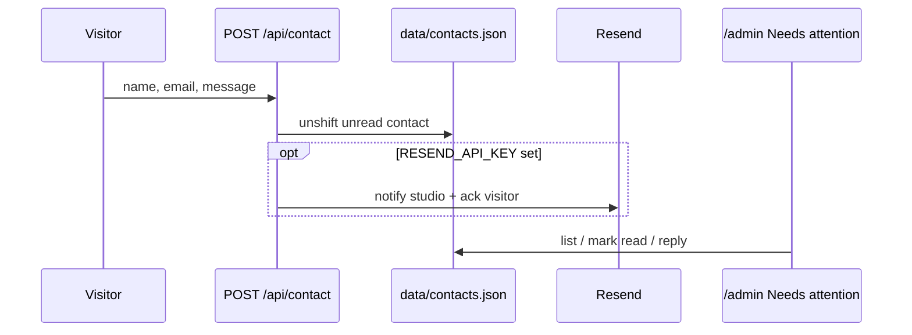
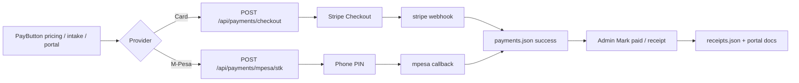
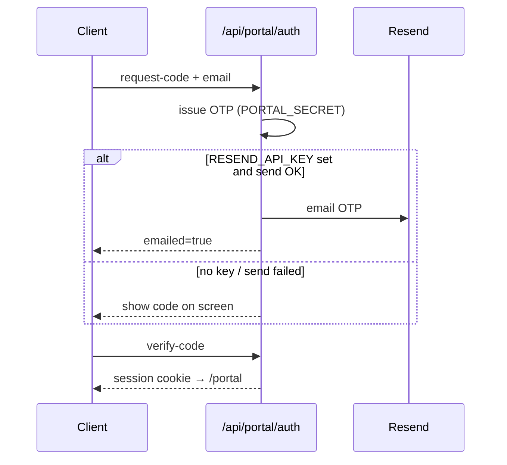

# External integrations — The Beacon Studio

Everything you need to configure for email, payments, AI, auth, and analytics.
Leave a key unset and the site stays usable with graceful fallbacks (on-screen OTP, coming-soon pay messages, local knowledge base).

Copy `.env.example` → `.env.local` and fill values for your environment.

---

## Quick map

| Integration | Used for | Required? |
|---|---|---|
| **Resend** | Contact notify + ack, subscribe confirm, booking confirm, portal OTP | Optional |
| **Stripe** | Checkout deposits / invoices (pricing, intake, portal) | Optional |
| **M-Pesa Daraja** | STK Push deposits / invoices (pricing, intake, portal) | Optional |
| **OpenAI** | Glow assistant + brief improver | Optional |
| **ADMIN_PASSWORD** | `/admin` login | **Required** |
| **PORTAL_SECRET** | Portal JWT / OTP signing | Recommended (falls back to `ADMIN_PASSWORD` in dev) |
| **Analytics** | Local `data/analytics.json` (future: PostHog / Vercel) | Built-in |

---

## 1. Resend (email)

**Env**

```bash
RESEND_API_KEY=re_...
RESEND_FROM_EMAIL=studio@yourdomain.com
```

**Where it fires**

| Flow | To | Trigger |
|---|---|---|
| Contact form | Studio + visitor ack | `POST /api/contact` |
| Subscribe | Subscriber confirm | `POST /api/subscribe` |
| Book a Call | Guest + studio | `POST /api/book` |
| Portal OTP | Client email | `POST /api/portal/auth` (`request-code`) |

**Setup**

1. Create account at [resend.com](https://resend.com).
2. Verify your domain (or use `onboarding@resend.dev` for sandbox).
3. Create an API key → `RESEND_API_KEY`.
4. Set `RESEND_FROM_EMAIL` to a verified sender.
5. Without keys: forms still save to `data/*.json`; portal shows the OTP on-screen.

Helper: `src/lib/resend.ts`.

---

## 2. Stripe (card / Checkout)

**Env**

```bash
STRIPE_SECRET_KEY=sk_...
NEXT_PUBLIC_STRIPE_PUBLISHABLE_KEY=pk_...
# Optional Price IDs (should match 30% deposit of tier floor)
STRIPE_PRICE_SPRINT_DEPOSIT=
STRIPE_PRICE_PRODUCT_DEPOSIT=
STRIPE_PRICE_RETAINER_DEPOSIT=
```

**Endpoints**

- `POST /api/payments/checkout` — create Checkout Session (deposit or invoice)
- `POST /api/payments/stripe/webhook` — mark payment success on `checkout.session.completed`

**UI surfaces (Stripe + M-Pesa both offered)**

- Pricing cards → `PayButton`
- Project intake wizard → `PayButton`
- Client portal “Next payment” → `PayButton` (`projectId` attached)
- Admin → **Mark paid** creates a receipt (`payment.mark-paid`)

**Setup**

1. Create a Stripe account → Developers → API keys.
2. Set `STRIPE_SECRET_KEY` (and optional publishable key).
3. Point webhook to `https://YOUR_DOMAIN/api/payments/stripe/webhook`.
4. Without `STRIPE_SECRET_KEY`: API returns `coming_soon` + mailto / book fallbacks.

Deposit amount = tier floor × `siteConfig.payments.depositPercent` (default **30%**).

---

## 3. M-Pesa Daraja (STK Push)

**Env**

```bash
MPESA_CONSUMER_KEY=
MPESA_CONSUMER_SECRET=
MPESA_SHORTCODE=
MPESA_PASSKEY=
MPESA_CALLBACK_URL=https://YOUR_DOMAIN/api/payments/mpesa/callback
MPESA_ENV=sandbox
# Optional USD→KES rate (default 130)
MPESA_KES_RATE=130
```

**Endpoints**

- `POST /api/payments/mpesa/stk` — initiate STK Push
- `POST /api/payments/mpesa/callback` — Safaricom result → reconcile `payments.json`

**Setup**

1. Create an app at [developer.safaricom.co.ke](https://developer.safaricom.co.ke/).
2. Copy Consumer Key / Secret; use Lipa Na M-Pesa Online shortcode + passkey.
3. Expose a public HTTPS callback (ngrok for local sandbox).
4. Without keys: API returns `coming_soon` + mailto / book / call fallbacks.

---

## 4. OpenAI (Glow)

**Env**

```bash
OPENAI_API_KEY=
# OPENAI_MODEL=gpt-4o-mini
```

Without a key, Glow uses the on-site knowledge base (`src/lib/knowledge-base.ts`) + `assistant-context.ts` built from `site.ts`. FAB works on **all** pages including `/admin` and `/portal`.

---

## 5. Auth secrets

```bash
ADMIN_PASSWORD=change-me          # /admin PIN
PORTAL_SECRET=change-me-portal    # JWT + OTP HMAC (falls back to ADMIN_PASSWORD in local/dev)
```

---

## 6. Analytics

**Current:** events + vibe reactions persist to `data/analytics.json` via `POST /api/analytics`. Admin reads them at `/admin`.

**Future options (not wired yet):**

- **PostHog** — product analytics + session replay
- **Vercel Analytics** — Web Vitals on Vercel deploys

Keep local file storage for ops inbox; add a third-party beacon later without blocking launches.

---

## Workflow diagrams

### Contact → admin + email



### Subscribe → store + email

```mermaid
flowchart TD
  A[Newsletter popup / footer] --> B[POST /api/subscribe]
  B --> C{Valid email?}
  C -->|no| D[400 error]
  C -->|yes| E[Write subscribers.json unread]
  E --> F{Resend configured?}
  F -->|yes| G[Confirmation email]
  F -->|no| H[Skip email]
  E --> I[/admin Subscribers + Needs attention]
```

### Book → bookings.json + email

```mermaid
flowchart TD
  A[Book a Call modal] --> B[POST /api/book]
  B --> C[Check slot free]
  C --> D[unshift bookings.json status=pending]
  D --> E[Generate ICS]
  D --> F{Resend?}
  F -->|yes| G[Guest confirm + studio notify]
  F -->|no| H[ICS only in UI]
  D --> I[/admin Bookings panel]
```

### Pay → Stripe / M-Pesa → receipt



### Portal OTP → Resend or on-screen



---

## Payment path audit

| Surface | Stripe | M-Pesa STK | Fallback without keys |
|---|---|---|---|
| Pricing deposit | ✅ | ✅ | coming_soon + mailto / book |
| Intake wizard | ✅ | ✅ | same |
| Portal next payment | ✅ | ✅ | same (`projectId` stored) |
| Admin mark-paid | N/A (manual) | N/A | Creates receipt; uses `payment.projectId` when present |

---

## Data files (local ops)

All under `data/` (gitignored in production deploys — persist via volume or migrate to a DB later):

- `contacts.json`, `subscribers.json`, `bookings.json`, `intakes.json`
- `payments.json`, `projects.json`, `clients.json`, `messages.json`
- `quotations.json`, `receipts.json`, `analytics.json`

Admin inbox: `/admin` → **Needs attention** + per-panel drawers (bookings, intakes, contacts, subscribers, payments, vibe reactions).
